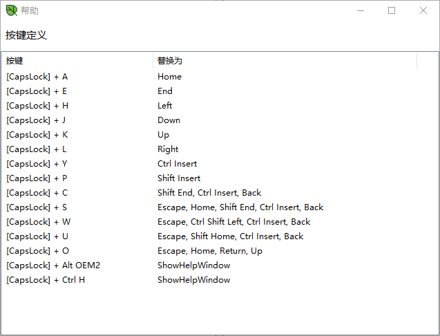

# Caplos 修改版

## 修改项如下：
- [x] 修改启动时帮助窗口先显示后隐藏的问题
- [x] 短按 CAPSLOCK 为大小写锁定功能，长按 CAPSLOCK 无操作，视为犹豫行为
- [x] 按个人习惯调整几个键位 
   - CAPSLOCK+A           = Home
   - CAPSLOCK+E           = End
   - CAPSLOCK+H           = Left
   - CAPSLOCK+J           = Down
   - CAPSLOCK+K           = Up
   - CAPSLOCK+L           = Right
   - CAPSLOCK+Y           = Copy
   - CAPSLOCK+P           = Paste
   - CAPSLOCK+U           = Delete from cursor to line begin
   - CAPSLOCK+C           = Delete from cursor to line end
   - CAPSLOCK+S           = Delete current line
   - CAPSLOCK+W           = Delete left word
   - CAPSLOCK+O           = Insert blank before this line
   - CAPSLOCK+Alt+?       = Show help window
- [x] 只允许一个进程启动
- [x] 修改默认配置文件打包方式
- [x] 调整配置文件格式
- [x] 支持 CAPSLOCK 组合按键：支持 ALT, CTRL

## 下载
[Caplos.exe](https://github.com/kkzi/Caplos/releases/download/v2.0.0/Caplos.exe)

## 主界面

 
 
 

> 以下为原 [repo](https://github.com/pluveto/caplos/) 说明 
----

# Caplos - CapsLock#

A tool to squeeze the power of your CapsLock key.

一个充分利用你的大小写键的工具, 可以最小化打字/写代码时的按键距离.

## 功能

* 大小写状态指示

软件会在任务栏显示为一个绿叶图标, 当你的键盘为大写状态时, 图标是绿色, 当小写时, 图标为白色.

* 可扩展的按键替换

本程序实现了真正的按键替换，可以完全等效为目标按键。比如你输入法选字的时候也可以用，代码提示选代码也可以用。还可以让 大小写键和 CTRL 等按键集成，比如一般状态下 Ctrl+← 是向左跳一个单词，使用本工具可以让 Ctrl+大小写+H 同样实现向左跳一个单词。

* 没有其它凌乱臃肿不必要的功能

体积仅 50kb 满足需求.

## 使用方法

按下 \[大小写键\] 的同时按下其它按键, 可执行替换后的按键的功能.

举例:

使用组合键 `[大小写]+H/J/K/L` 移动光标

使用组合键 `[大小写]+'` 进行退格删除

如果你是单手打字爱好者, 这个程序能让你更加轻松地打字.

## 键位表 (可自定义)

(如果没加载出来, 到[这里](https://www.pluvet.com/archives/calos.html)也可以看)

## 设置项

### 如何自定义键位？

首次运行后，会生成 `Caplos.cfg` 文件，编辑即可。

### 如何自定义图标是否显示？

编辑 `Caplos.exe.config`，找到 `<add key="showIcon" value="true"/>` 配置项，`true`  表示显示，`false` 表示不显示。

## 下载地址:

1. 可以直接下载二进制文件: https://wwx.lanzoui.com/idVu9rj3h8j (2021-07-17更新)
2. 此版本支持 Ctrl+Space 切换中英文。仅供测试：https://wwx.lanzoui.com/iby7Xrj3tgj
3. 也可以自己编译

## 开源地址：

https://github.com/pluveto/caplos/

